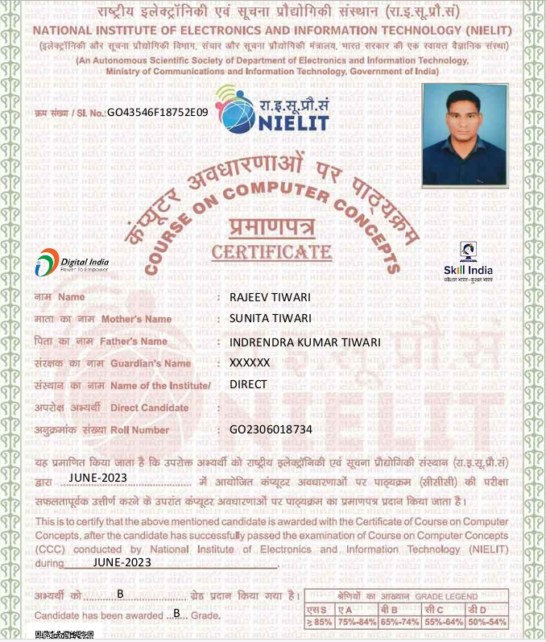
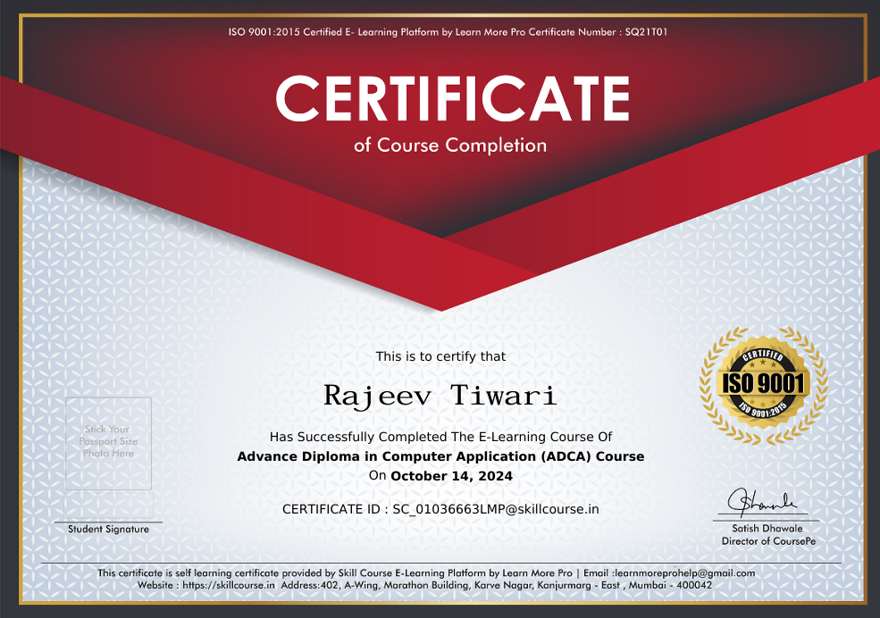
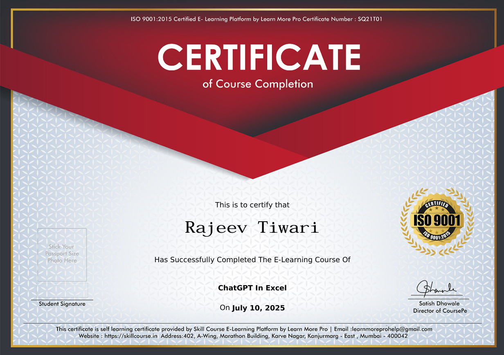
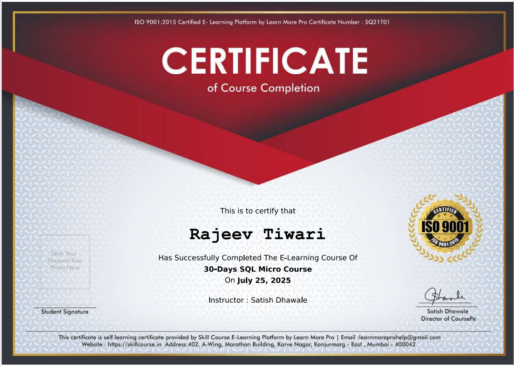
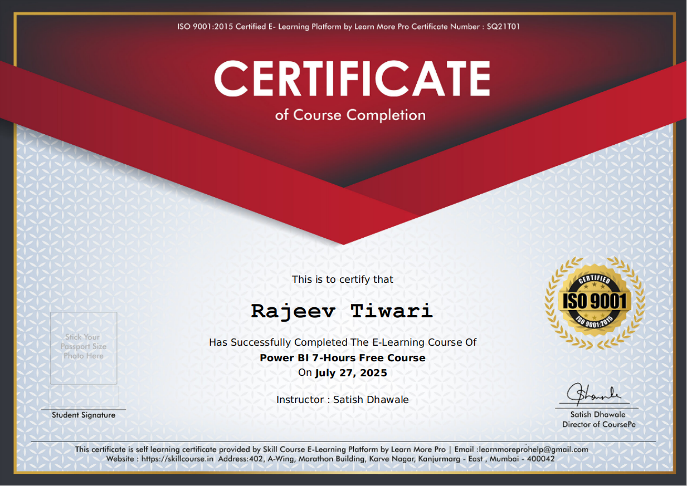

## 📑 Table of Contents

- <a href="#introduction">*📌 Introduction*</a>  
- <a href="#overview">*📜 Certification Overview*</a>  
- <a href="#ccc">*✅ CCC – Course on Computer Concepts* (*NIELIT, Jun 2023*)</a>  
- <a href="#tally-prime">*✅ Tally Prime with GST* (*Skill Course, Apr 2024*)</a>  
- <a href="#adca">*✅ ADCA – Advance Diploma in Computer Application* (*Skill Course, Oct 2024*)</a>  
- <a href="#ms-office">*✅ Microsoft Office Crash Course* (*Skill Course, Jul 2025*)</a>  
- <a href="#excel-ai">*✅ ChatGPT in Excel* (*Skill Course, Jul 2025*)</a>  
- <a href="#sql">*✅ 30 Days SQL Micro Course* (*Skill Course, Jul 2025*)</a>  
- <a href="#power-bi">*✅ 30 Days Power BI Micro Course* (*Skill Course, Jul 2025*)</a> 
- <a href="#power-query">*✅ Power Query Corporate Training Masterclass* (*Skill Course, Oct 2025*)</a>
- <a href="#github">*✅ GitHub Basics* (*Simplilearn, Nov 2025*)</a>
- <a href="#excel">*✅ Introduction to MS Excel* (*Microsoft, Nov 2025*)</a>
- <a href="#power query in excel">*✅ Introduction to Power Query in Excel Basics* (*Microsoft, Nov 2025*)</a>
- <a href="#databricks-sql">*✅ SQL Analytics and BI on Databricks* (*Databricks, Nov 2025*)</a>
- <a href="#access-essential">*✅ Microsoft Access Essential Training* (*Office 2024/LTSC*) (*LinkedIn, Nov 2025*)</a>
- <a href="#essential-excel">*✅ Essentials of MS Excel - Formulas and Functions* (*Uniathena, Nov 2025*)</a>
- <a href="#introduction-sql">*✅ Introduction to SQL* (*Simplilearn, Nov 2025*)</a>
- <a href="#excel-dashboard">*✅ Excel Dashboard for Beginners* (*Microsoft, Nov 2025*)</a>
- <a href="#da-postgresql">*✅ Data Analysis with PostgreSQL* (*LinkedIn, Nov 2025*)</a>
- <a href="#powerbi-beginners">*✅ Power BI for Beginners* (*Microsoft, Nov 2025*)</a>
- <a href="#data-analyst-101">*✅ Data Analyst 101* (*Microsoft, Nov 2025*)</a>
- <a href="#data-visualization-using-ms-excel">*✅ Essentials of Data Visualization using MS Excel* (*Uniathena, Nov 2025*)</a>
- <a href="#introduction-to-business-communication">*✅ Introduction to Business Communication* (*Simplilearn, Nov 2025*)</a>
- <a href="#introduction-to-data-analytics">*✅ Introduction to Data Analytics* (*Simplilearn, Nov 2025*)</a>
- <a href="#google-sheets-advanced-topics">*✅ Google Sheets - Advanced Topics* (*Google Cloud, Nov 2025*)</a>
- <a href="#data-visualization-with-tableau">*✅ Basics of Data Visualization with Tableau* (*Uniathena, Nov 2025*)</a>
- <a href="#web-app-development">*✅ Master AI for Web App Development* (*Simplilearn, Nov 2025*)</a>
- <a href="#chatGPT-advanced-course">*✅ ChatGPT Advanced Course* (*Simplilearn, Nov 2025*)</a>
- <a href="#final-note">*📌 Final Note*</a>  
- <a href="#contact">*📬 Connect with Me*</a>    

---

## 📌 Introduction  

This repository showcases my **verified credentials** and **professional certifications**, each highlighting what I learned and how it supports my growth. It reflects my **diverse skills** and commitment to **continuous learning**, staying **industry-relevant**, and keeping my abilities **current and valua**

---

## 📜 Certification Overview 

My certifications highlight key milestones in my learning journey, from **basic computer concepts** to **Data Analysis** with tools like **Excel, Access, Power Query, SQL, Power BI, Tableau, and VBA**, and also **introductory web technologies**. They reflect my **commitment to practical, real-world skills**, staying updated with **industry tools**, and delivering **high-quality work**.

---

***✅ CCC – Course on Computer Concepts*** (*NIELIT, Jun 2023*)

Completed in **June 2023**, the **CCC certification** by **NIELIT** laid the foundation for my IT learning journey.  
It covered **computer basics, Microsoft Office, email, networking, and cybersecurity**, with an introduction to **IoT**.  
This milestone sparked my interest to explore **advanced software, data tools, and programming**.

---

***✅ Tally Prime with GST*** (*Skill Course, Apr 2024*) 

---

***✅ ADCA – Advance Diploma in Computer Application*** (*Skill Course, Oct 2024*) 

---

***✅ Microsoft Office Crash Course*** (*Skill Course, Jul 2025*) 

---

***✅ ChatGPT in Excel*** (*Skill Course, Jul 2025*)

---

***✅ 30 Days SQL Micro Course*** (*Skill Course, Jul 2025*)

---

***✅ 30 Days Power BI Micro Course*** (*Skill Course, Jul 2025*)

---

 ***✅ Power Query Corporate Training Masterclass*** (*Skill Course, Oct 2025*)

---

***✅ GitHub Basics*** (*Simplilearn, Nov 2025*)

[*Show Credential↗*](https://simpli-web.app.link/e/Or633oKAmYb)

---

***✅ Introduction to MS Excel*** (*Microsoft, Nov 2025*)

[*Show Credential↗*](https://simpli-web.app.link/e/cJ5Wj11AmYb)

---

***✅ Introduction to Power Query in Excel Basics*** (*Microsoft, Nov 2025*)

[*Show Credential↗*](https://simpli-web.app.link/e/1hTHLVqBmYb)

---

***✅ SQL Analytics and BI on Databricks*** (*Databricks, Nov 2025*)

[*Show Credential↗*](https://simpli-web.app.link/e/koyAhfyBmYb)

---

***✅ Microsoft Access Essential Training*** (*Office 2024/LTSC*) (*LinkedIn, Nov 2025*)

*Show Credential↗* *-----*

---

***✅ Essentials of MS Excel - Formulas and Functions*** (*Uniathena, Nov 2025*)

[*Show Credential↗*](https://docs.uniathena.com/prod/course/certificate/814_1762676336_certificate.jpg)

---

***✅ Introduction to SQL*** (*Simplilearn, Nov 2025*)

[*Show Credential↗*](https://simpli-web.app.link/e/Ea7LK16BmYb)

---

***✅ Excel Dashboard for Beginners*** (*Microsoft, Nov 2025*)

[*Show Credential↗*](https://simpli-web.app.link/e/2KbK36JscYb)

---

***✅ Data Analysis with PostgreSQL*** (*LinkedIn, Nov 2025*)

*Show Credential↗* *-----*

---

***✅ Power BI for Beginners*** (*Microsoft, Nov 2025*)

[*Show Credential↗*](https://simpli-web.app.link/e/VLgIKIsleYb)

---

***✅ Data Analyst 101*** (*Microsoft, Nov 2025*)  

[*Show Credential↗*](https://simpli-web.app.link/e/mklw1d0reYb)

---

***✅ Essentials of Data Visualization using MS Excel*** (*Uniathena, Nov 2025*) 

[*Show Credential↗*](https://docs.uniathena.com/prod/course/certificate/124_1763028743_certificate.jpg)

--- 

***✅ Introduction to Business Communication*** (*Simplilearn, Nov 2025*)  

[*Show Credential↗*](https://simpli-web.app.link/e/RiZzAxALgYb)

---

***✅ Introduction to Data Analytics*** (*Simplilearn, Nov 2025*)  

[*Show Credential↗*](https://simpli-web.app.link/e/3pdOKncOhYb)

---

***✅ Google Sheets - Advanced Topics*** (*Google Cloud, Nov 2025*)  

[*Show Credential↗*](https://simpli-web.app.link/e/tXlwquxjjYb)

---

***✅ Basics of Data Visualization with Tableau*** (*Uniathena, Nov 2025*) 

[*Show Credential↗*](https://docs.uniathena.com/prod/course/certificate/348_1763361663_certificate.jpg)

---

***✅ Master AI for Web App Development*** (*Simplilearn, Nov 2025*) 

[*Show Credential↗*](https://simpli.app.link/fIsOl06oqYb)

---

***✅ ChatGPT Advanced Course*** (*Simplilearn, Nov 2025*) 

[*Show Credential↗*](https://simpli-web.app.link/e/ljhJ5gvOtYb)

---

## 📌 Final Note  

This repository serves as a secure, well-organized archive of my verified credentials, providing clear proof of my dedication to lifelong learning and continuous upskilling. Each credential demonstrates how I acquire relevant skills and apply them to deliver practical, high-quality work, reflecting my commitment to grow as a professional who can adapt, contribute, and add value in every role.

---

## 📬 Connect with Me  

- ✖️ **X**: *[@rajeevtiwari](https://x.com/rajeevtiwariRT)*
- 📧 **Email**: *[rajeevtiwari8055@gmail.com](mailto:rajeevtiwari8055@gmail.com)*  
- 💻 **GitHub**: *[github.com/rajeevgit8055hub](https://github.com/rajeevgit8055hub)*  
- 💼 **LinkedIn**: *[linkedin.com/in/rajeev-tiwari123](https://www.linkedin.com/in/rajeev-tiwari123)*  
- 🌐 **Website**: *[rajeevgit8055hub.github.io/rajeevtiwari.github.io](https://rajeevgit8055hub.github.io/rajeevtiwari.github.io/)*
  
🤝 ***Thank you for visiting my profile & Verified-Digital-Credentials repository!***

---
